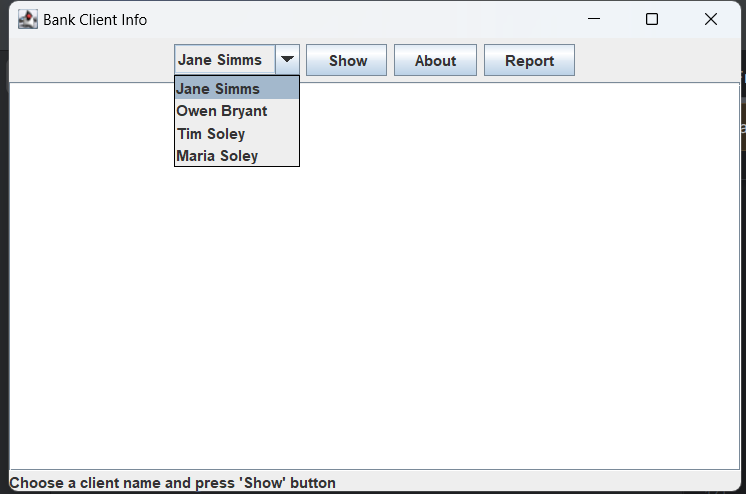
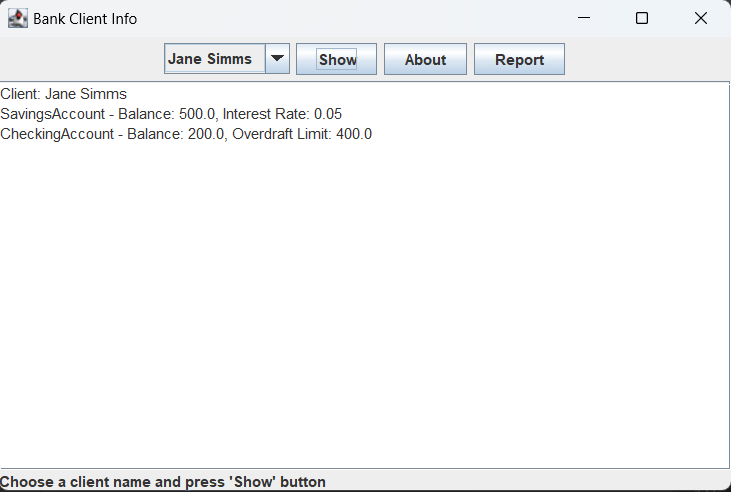
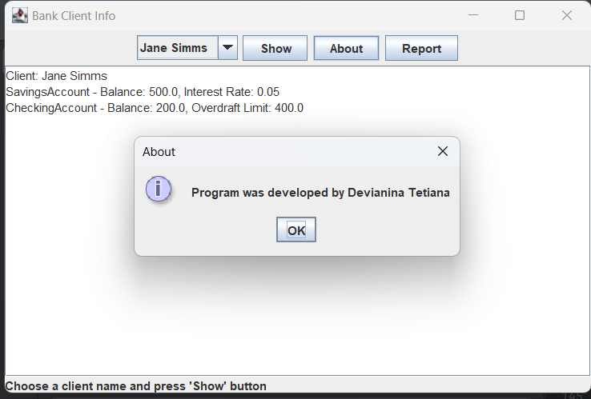
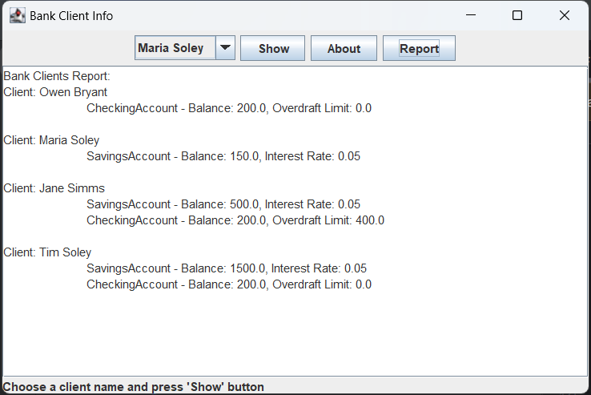

# UI Lab 4


## Скріни виконаної практичної роботи




## Код
```
package domain;

import javax.swing.*;
import java.awt.event.ActionEvent;
import java.awt.event.ActionListener;
import java.io.BufferedReader;
import java.io.FileReader;
import java.io.IOException;
import java.util.ArrayList;
import java.util.HashMap;

public class JFrame extends javax.swing.JFrame {
    private JComboBox<String> comboBox1;
    private JButton showButton;
    private JButton reportButton;
    private JButton aboutButton;
    private JTextArea textArea;
    private JLabel bottomLabel;

    private HashMap<String, Client> clients = new HashMap<>();

    public JFrame() {
   
        comboBox1 = new JComboBox<>();
        showButton = new JButton("Show");
        aboutButton = new JButton("About");
        reportButton = new JButton("Report");
        textArea = new JTextArea();
        bottomLabel = new JLabel("Choose a client name and press 'Show' button");
        setLayout(new java.awt.BorderLayout());

        
        JPanel topPanel = new JPanel();
        topPanel.add(comboBox1);
        topPanel.add(showButton);
        topPanel.add(aboutButton);
        topPanel.add(reportButton);
        add(topPanel, java.awt.BorderLayout.NORTH);
        add(new JScrollPane(textArea), java.awt.BorderLayout.CENTER);
        add(bottomLabel, java.awt.BorderLayout.SOUTH);

        loadData();


        showButton.addActionListener(new ActionListener() {
            @Override
            public void actionPerformed(ActionEvent e) {
                showClientInfo();
            }
        });

        reportButton.addActionListener(new ActionListener() {
            @Override
            public void actionPerformed(ActionEvent e) {
                generateReport();
            }
        });

        aboutButton.addActionListener(new ActionListener() {
            @Override
            public void actionPerformed(ActionEvent e) {
                showAboutDialog();
            }
        });


        setTitle("Bank Client Info");
        setSize(600, 400);
        setDefaultCloseOperation(javax.swing.JFrame.EXIT_ON_CLOSE);
        setVisible(true);
    }

    private void loadData() {
        try (BufferedReader br = new BufferedReader(new FileReader("data/test.dat"))) {
            String line = br.readLine();
            int numClients = Integer.parseInt(line.trim());

            for (int i = 0; i < numClients; i++) {
                String clientInfo = br.readLine().trim();
                String[] clientData = clientInfo.split("\\s+");

                if (clientData.length >= 3) {
                    String firstName = clientData[0];
                    String lastName = clientData[1];
                    int numAccounts = Integer.parseInt(clientData[2]);

                    Client client = new Client(firstName, lastName);
                    for (int j = 0; j < numAccounts; j++) {
                        line = br.readLine().trim();
                        String[] accountData = line.split("\\s+");

                        if (accountData.length >= 3) {
                            String type = accountData[0];
                            double balance = Double.parseDouble(accountData[1]);
                            double additionalInfo = Double.parseDouble(accountData[2]);

                            if (type.equals("S")) {
                                client.addAccount(new SavingsAccount(balance, additionalInfo));
                            } else if (type.equals("C")) {
                                client.addAccount(new CheckingAccount(balance, additionalInfo));
                            }
                        }
                    }
                    clients.put(firstName + " " + lastName, client);
                    comboBox1.addItem(firstName + " " + lastName);
                }
            }
        } catch (IOException e) {
            e.printStackTrace();
        } catch (NumberFormatException e) {
            e.printStackTrace();
            JOptionPane.showMessageDialog(this, "Error parsing data file", "Error", JOptionPane.ERROR_MESSAGE);
        }
    }


    private void showClientInfo() {
        String selectedClientName = (String) comboBox1.getSelectedItem();
        if (selectedClientName != null) {
            Client client = clients.get(selectedClientName);

            StringBuilder info = new StringBuilder();
            info.append("Client: ").append(selectedClientName).append("\n");
            for (Account account : client.getAccounts()) {
                info.append(account.toString()).append("\n");
            }

            textArea.setText(info.toString());
        }
    }

    private void generateReport() {
        StringBuilder report = new StringBuilder("Bank Clients Report:\n");
        for (String clientName : clients.keySet()) {
            Client client = clients.get(clientName);
            report.append("Client: ").append(clientName).append("\n");
            for (Account account : client.getAccounts()) {
                report.append("\t").append(account.toString()).append("\n");
            }
            report.append("\n");
        }
        textArea.setText(report.toString());
    }

    private void showAboutDialog() {
        JOptionPane.showMessageDialog(this, "Program was developed by Devianina Tetiana", "About", JOptionPane.INFORMATION_MESSAGE);
    }

    public static void main(String[] args) {
        new JFrame();
    }
}

class Client {
    private String firstName;
    private String lastName;
    private ArrayList<Account> accounts;

    public Client(String firstName, String lastName) {
        this.firstName = firstName;
        this.lastName = lastName;
        this.accounts = new ArrayList<>();
    }

    public void addAccount(Account account) {
        accounts.add(account);
    }

    public ArrayList<Account> getAccounts() {
        return accounts;
    }
}

abstract class Account {
    protected double balance;

    public Account(double balance) {
        this.balance = balance;
    }

    @Override
    public String toString() {
        return getClass().getSimpleName() + " - Balance: " + balance;
    }
}

class SavingsAccount extends Account {
    private double interestRate;

    public SavingsAccount(double balance, double interestRate) {
        super(balance);
        this.interestRate = interestRate;
    }

    @Override
    public String toString() {
        return super.toString() + ", Interest Rate: " + interestRate;
    }
}

class CheckingAccount extends Account {
    private double overdraftLimit;

    public CheckingAccount(double balance, double overdraftLimit) {
        super(balance);
        this.overdraftLimit = overdraftLimit;
    }

    @Override
    public String toString() {
        return super.toString() + ", Overdraft Limit: " + overdraftLimit;
    }
}

```
Це одна з робіт, які доповнюють основний цикл лабораторних робіт #1-8 (проект **Banking**, [Netbeans](https://netbeans.org/)) з ООП.  Основна мета цих додаткових вправ - познайомитись з різними видами інтерфейсів користувача та засобами їх створення. Згадувані 'базові' роботи розміщено в [окремому репозиторії](https://github.com/liketaurus/OOP-JAVA) (якщо будете робити завдання на "4" або "5" раджу переглянути [діаграму класів](https://github.com/liketaurus/OOP-JAVA/blob/master/MyBank.png), аби розуміти які методи є у класів).

В ході роботи вам пропонується виконати **наступне завдання** - [Робота 4: GUI з Matisse](https://github.com/ppc-ntu-khpi/GUI-Lab2-Starter/blob/master/Lab%204%20-%20Matisse/Lab%204.md)
  
**Додаткове завдання** (для тих хто зробив все і прагне більшого): [дивіться тут](https://github.com/ppc-ntu-khpi/GUI-Lab2-Starter/blob/master/Lab%204%20-%20Matisse/Lab%20-%204%20-%20add.md)

Всі необхідні бібліотеки містяться у теці [jars](https://github.com/ppc-ntu-khpi/GUI-Lab2-Starter/tree/master/jars). В тому числі - всі необхідні відкомпільовані класи з робіт 1-8 - файл [MyBank.jar](https://github.com/ppc-ntu-khpi/GUI-Lab2-Starter/blob/master/jars/MyBank.jar). Файл даних лежить у теці [data](https://github.com/ppc-ntu-khpi/GUI-Lab2-Starter/tree/master/data).

---
**УВАГА! Не забуваємо здавати завдання через Google Classroom та вказувати посилання на створений для вас репозиторій!**

Також пам'ятайте, що ніхто не заважає вам редагувати файл README у вашому репозиторії😉.

[](https://gitter.im/PPC-SE-2020/OOP?utm_source=badge&utm_medium=badge&utm_campaign=pr-badge)


 
